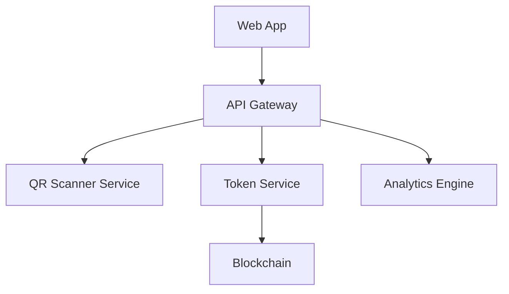

# MetroGreen - Sustainable Transit Rewards

MetroGreen is an innovative platform that rewards metro commuters for their eco-conscious travel choices. By choosing public transit, users earn tokens that can be redeemed for rewards while making a positive environmental impact.

## 🌱 Our Mission

To incentivize sustainable urban mobility by rewarding metro commuters for their environmentally conscious travel choices. We aim to:

- Reduce urban carbon emissions
- Promote public transportation
- Create a rewarding eco-friendly commuting experience
- Build a community of environmentally conscious travelers

## ⚡ How It Works

1. **Scan QR Code**
   - Use our web app to scan your metro ticket's QR code
   - Instant verification of journey details
   - Secure processing of travel data

2. **Earn Green Tokens**
   - Each verified journey earns you Green Tokens
   - Tokens are calculated based on distance traveled
   - Additional bonuses for peak-hour public transit use

3. **Redeem Rewards**
   - Use tokens at partner stores within metro stations
   - Access exclusive deals and discounts
   - Convert environmental impact into real value

## 🌟 Key Features

### Instant QR Verification
- Secure QR code scanning technology
- Real-time journey validation
- Tamper-proof verification system

### Blockchain-Powered Rewards
- Transparent token distribution
- Secure transaction records
- Immutable journey verification

### Environmental Impact Tracking
- Personal carbon savings dashboard
- Community impact statistics
- Monthly environmental reports

## 🔒 Privacy & Security

MetroGreen prioritizes user privacy and data security:

- End-to-end encryption for all data
- No personal journey data stored
- Compliance with data protection regulations
- Regular security audits

## 🤝 Partner Network

We've partnered with various businesses across the metro network:

- Coffee shops and restaurants
- Convenience stores
- Bookstores
- Local retailers

## 📊 Impact Statistics

- **50,000+** Active Users
- **120 Tons** CO₂ Saved
- **₹2M+** Rewards Distributed
- **200+** Partner Stores

## 💻 Technical Architecture

Our platform is built on modern, scalable technologies:

### Key Components:
- React Native Mobile App
- Node.js Backend
- Hedera Blockchain
- QR Code Verification System
- AWS Cloud Infrastructure

## 🎯 Future Roadmap

1. **Q2 2024**
   - Multi-city expansion
   - Enhanced reward mechanisms
   - Community features

2. **Q3 2024**
   - Integration with more transit systems
   - Advanced impact analytics
   - Partner API platform

3. **Q4 2024**
   - International markets
   - Carbon credit integration
   - Enhanced gamification

## 🌍 Environmental Impact Model

Our carbon savings are calculated using:

- Distance traveled
- Average vehicle emissions
- Public transit efficiency factors
- Peak hour impact multipliers

## 💬 Community & Support

Join our community:
- Discord: [MetroGreen Community]
- Twitter: [@MetroGreen]
- Email: support@metrogreen.com

## 📱 Get Started

1. Open the MetroGreen Website
3. Scan your first metro ticket QR code
4. Start earning rewards

[Download Now](#) | [Watch Demo](#)

---

## Awards & Recognition

- 🏆 Best Green Tech Innovation 2024
- 🌱 Sustainable Transit Solution Award
- ⭐ Top Climate Action Project

---

Built with ❤️ by the MetroGreen Team
